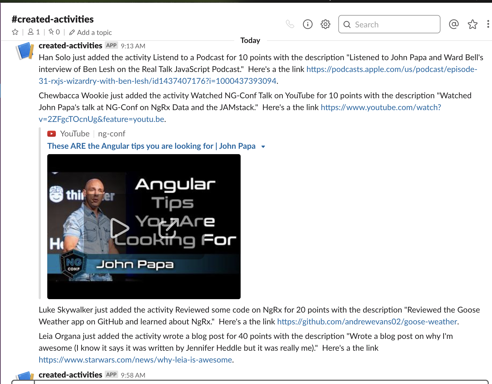
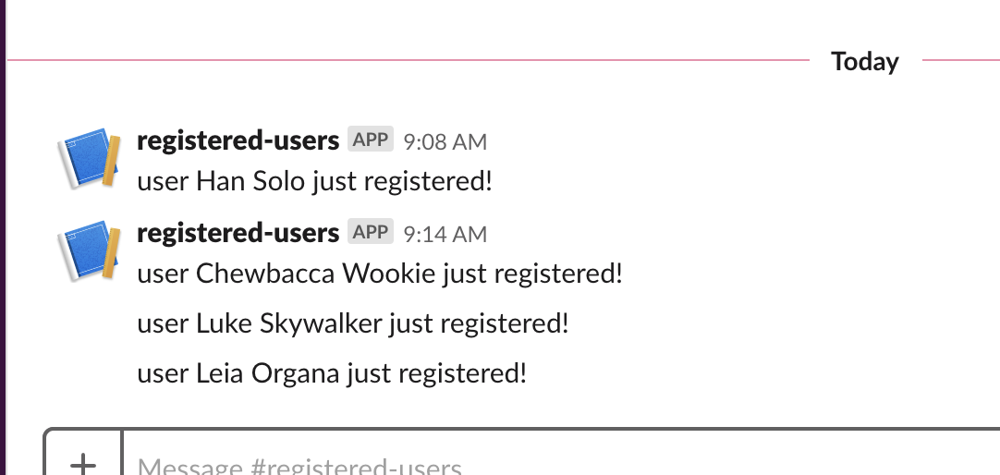

# Slack Integration

The Overwatch Challenge has slack integration for:

1. When activities are created
2. When users register with the app
3. When High Scores are tallied

This is all done with Google Firebase Cloud Functions.  Whenever records are added to the firestore NoSQL database, the cloud functions are triggered. 

_Note: the images here were from an older version of the app, the intent and general presentation are the same though_

[click here to go back to the main site](https://overwatch-challenge.com/home)
